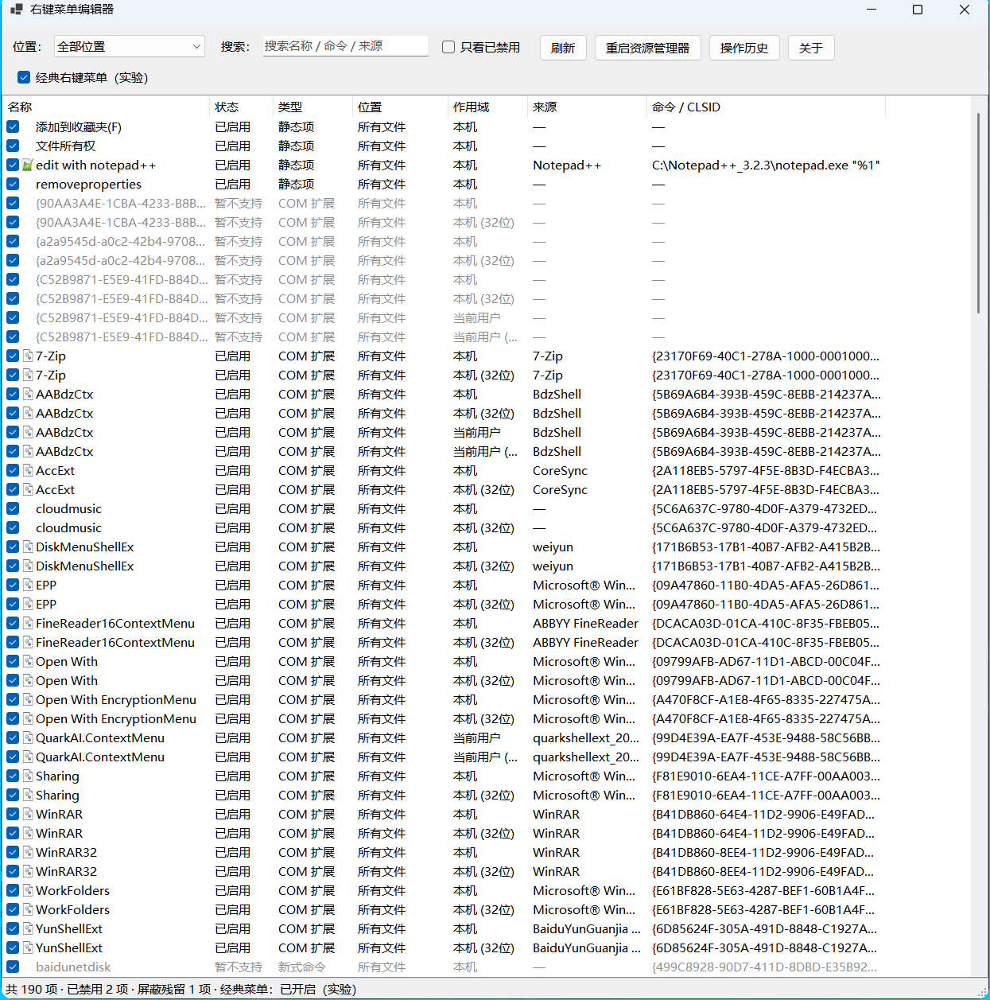

# 右键菜单编辑器（Context Menu Editor）

> 把不想要的 Windows 右键菜单项**禁用**掉，随时再**恢复**。所有操作非破坏性、可逆——本工具不删除任何菜单项注册表键。



## 功能

- 集中列出资源管理器右键菜单里的项目：**静态菜单项** + **COM shell 扩展**
- 勾选 / 取消勾选即可启用 / 禁用；所有写操作都有确认对话框
- 双击查看详情：命令、CLSID、注册表路径，可一键在 regedit 中定位
- 位置筛选：所有文件 / 文件夹 / 文件夹背景 / 驱动器 / 桌面背景 / 所有对象 / COM 扩展 / 已屏蔽残留
- 搜索（名称、命令、来源）+「只看已禁用」过滤
- **操作历史与撤销**：每次改动都有日志，可逐条回滚
- 一键**重启资源管理器**（以当前用户身份重启，不会产生提权的 explorer 进程）
- 系统关键项标记（如文件夹的「打开 / 在新窗口中打开」），禁用前二次警告
- 实验性功能：Windows 11 经典 / 新式右键菜单切换

## 系统要求

- Windows 10 1809+ / Windows 11
- 无需安装 .NET 运行时（自包含单文件 exe，约 65 MB）
- 运行需要管理员权限（UAC）：绝大多数菜单项位于 HKLM，写入需要提权

## 使用

1. 从 [Releases](https://github.com/heathacosta259519-dot/akagi-toolbox/releases) 下载 zip，解压得到 `ContextMenuEditor.exe`
2. 双击运行；列表里**取消勾选 = 禁用**（从菜单隐藏），**重新勾选 = 恢复**
3. 多数改动在新打开的菜单里立即生效；若没生效，点「重启资源管理器」
4. 想反悔时打开「操作历史」，选中记录点「撤销选中」

## 工作原理

| 对象 | 禁用方式 | 恢复方式 |
|---|---|---|
| 静态菜单项（`shell\<verb>`） | 给 verb 键写入空值 `LegacyDisable` | 删除该值 |
| COM 扩展（`shellex\ContextMenuHandlers`） | 把扩展的 CLSID 加入 Windows 官方屏蔽列表 `Shell Extensions\Blocked` | 从屏蔽列表移除 |
| Win11 经典右键菜单（实验） | 写入 CLSID 覆盖键 | 删除该键 |

这些机制都是"标记式"的：原始的菜单项注册信息原封不动，因此禁用/恢复可以无限来回切换。这也意味着你随时可以手动检查或清理（详情对话框提供「在注册表中打开」）。

操作日志：`%APPDATA%\ContextMenuEditor\journal.ndjson`

## 常见问题

**改了菜单没变化？**
先点「重启资源管理器」。另外 Win11 的「新式菜单」只显示部分项目，其余项在「显示更多选项」（Shift+F10）里。

**怎么彻底还原成原样？**
在列表里把勾重新勾上即可。即使卸载本工具，已禁用的项也会保持状态——把 `LegacyDisable` 值删掉、或把 CLSID 从 Blocked 列表移除就恢复了。

**为什么需要管理员权限？**
大部分菜单项注册在 HKLM（机器级作用域），写入需要提权。工具全程使用管理员权限，操作前都有确认提示。

**杀毒软件报毒？**
自包含的 .NET 单文件 exe 体积较大，偶尔会被启发式引擎误报。可用 `build.ps1` 从源码自行构建核对。

**列表里「暂不支持」是什么？**
少数新式菜单项（`ExplorerCommandHandler`）不使用经典命令机制，当前版本暂不支持禁用，已列入路线图。

## 从源码构建

前置：.NET SDK 8+（Windows）

```powershell
cd tools/context-menu-editor
dotnet test .\tests\ContextMenuEditor.Tests    # 运行测试
.\build.ps1                                    # 测试 + 发布单文件 exe + 打包 zip
```

产物在 `dist/`：`ContextMenuEditor.exe` 与 `context-menu-editor-vX.Y.Z-win-x64.zip`。

## 开发说明

- 结构：`src/ContextMenuEditor`（主程序，WinForms / net8.0-windows）、`tests/ContextMenuEditor.Tests`（xunit）
- 测试在 HKCU 沙盒里创建临时菜单项做「禁用 → 恢复」往返验证，不会触碰真实菜单项
- 注册表写点只有两处（`Services/ToggleService.cs`），扫描逻辑在 `Services/RegistryScanner.cs`

## 路线图

- 支持「发送到」「新建（ShellNew）」菜单
- 对新型 `ExplorerCommand` 项提供"导出备份 + 移除"回退机制
- 配置导出 / 导入（在多台机器之间同步菜单方案）

## 许可证

[MIT](../../LICENSE)
