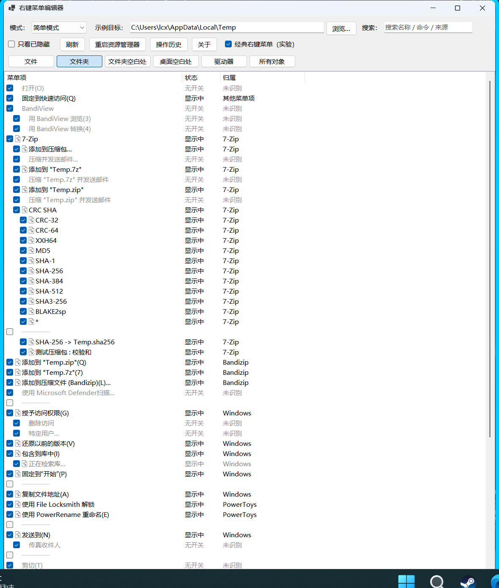
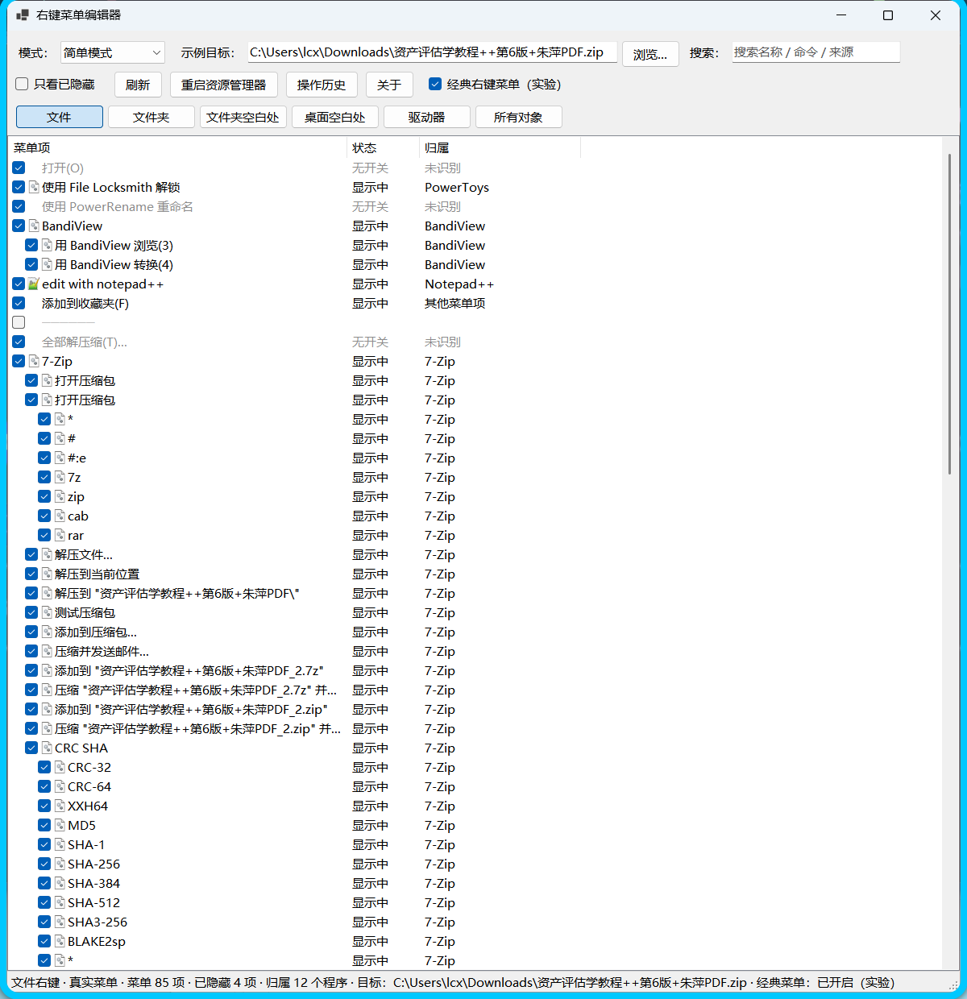
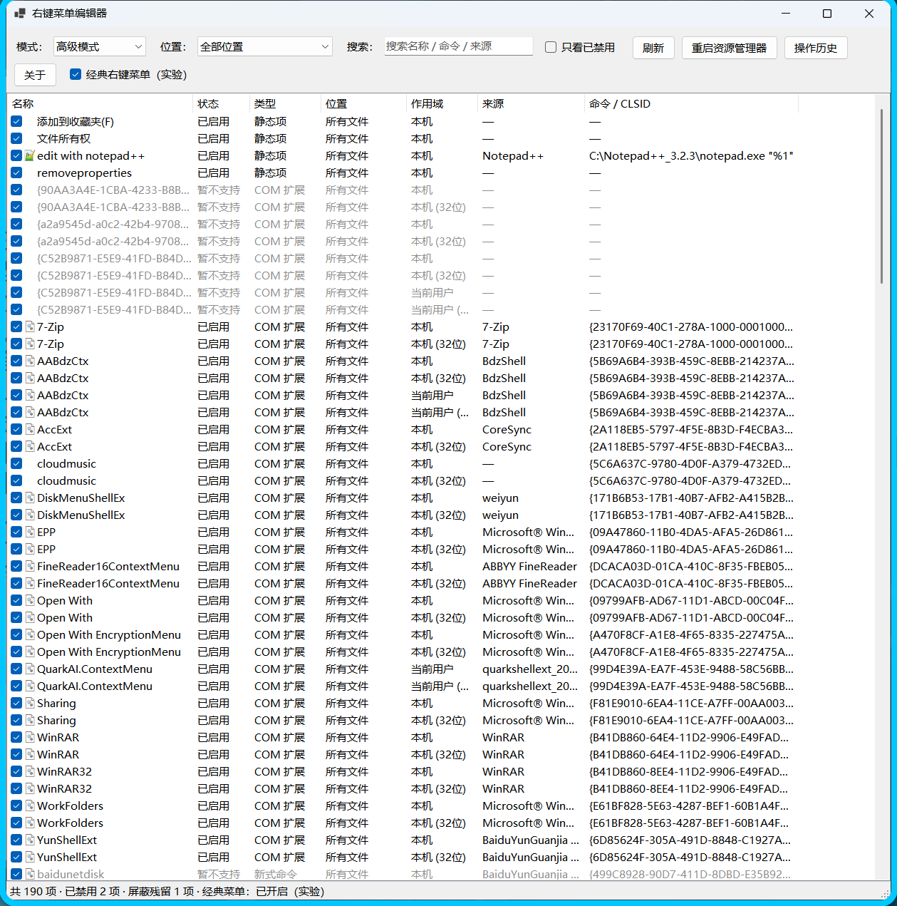

# 右键菜单编辑器（Context Menu Editor）

> 把不想要的 Windows 右键菜单项**隐藏**掉，随时再**恢复**。所有操作非破坏性、可逆——本工具不删除任何菜单项注册表键。

## 两种模式

### 简单模式（默认）



列表就是**你右键时看到的那个菜单本身**——程序真的把菜单构建出来再读回来（和资源管理器同一套机制），所以文字、顺序、子菜单、分隔线、灰显都和菜单一致：

- **场景标签页**：文件 / 文件夹 / 文件夹空白处 / 桌面空白处 / 驱动器 / 所有对象，点一下即切换
- **示例目标**：菜单内容与你右键的对象有关（`添加到 "xxx.zip"(Q)` 这类文字是程序运行时生成的）。顶部可填一个示例文件/文件夹，或点「浏览…」选一个，选择会记住
- **归属列**：每项标出它属于哪个程序（`7-Zip`、`Bandizip`、`PowerToys`、`BandiView`、`Windows`…）；子菜单里的项跟着父项归属，认不出来的显示「未识别」
- **取消勾选 = 隐藏**：菜单里当前出现的项都是勾上的，取消勾选即写注册表隐藏它（静态项写 `LegacyDisable`，COM 扩展进官方屏蔽列表；新型 `ExplorerCommand` 项同样可隐藏），之后它会挪到列表末尾的「已隐藏」区，重新勾上就恢复
- 状态列标「无开关」的（剪切 / 复制 / 属性 / 发送到 这类 Windows 自带项，或程序运行时临时生成的项）没有注册表开关，无法隐藏
- 菜单由**独立子进程**构建：第三方扩展最容易出问题的地方被隔离，卡住 25 秒会自动放弃并退回注册表视图，不会把主程序拖死



### 高级模式



面向需要看细节的人：按注册位置、作用域（本机 / 当前用户）、视图（64 / 32 位）展开的完整清单（本机约 190 条），额外提供类型、命令 / CLSID、注册表路径等列，以及「已屏蔽残留」清理。

## 系统要求

- Windows 10 1809+ / Windows 11
- 无需安装 .NET 运行时（自包含单文件 exe）
- 运行需要管理员权限（UAC）：绝大多数菜单项位于 HKLM，写入需要提权

## 使用

1. 从 [Releases](https://github.com/heathacosta259519-dot/akagi-toolbox/releases) 下载 zip，解压得到 `ContextMenuEditor.exe`
2. 双击运行；默认进入简单模式，点场景标签页（文件 / 文件夹 / 文件夹空白处…）后**取消勾选 = 隐藏**，**重新勾选 = 恢复**
3. 多数改动在新打开的菜单里立即生效；若没生效，点「重启资源管理器」
4. 想反悔时打开「操作历史」，选中记录点「撤销选中」
5. 需要看原始注册信息时，把「模式」切到「高级模式」；双击任意一行可看详情并一键在 regedit 中定位

## 工作原理

| 对象 | 隐藏方式 | 恢复方式 |
|---|---|---|
| 静态菜单项（`shell\<verb>`） | 给 verb 键写入空值 `LegacyDisable` | 删除该值 |
| COM 扩展（`shellex\ContextMenuHandlers`） | 把扩展的 CLSID 加入 Windows 官方屏蔽列表 `Shell Extensions\Blocked` | 从屏蔽列表移除 |
| Win11 经典右键菜单（实验） | 写入 CLSID 覆盖键 | 删除该键 |

这些机制都是"标记式"的：原始的菜单项注册信息原封不动，因此隐藏/恢复可以无限来回切换。这也意味着你随时可以手动检查或清理（详情对话框提供「在注册表中打开」）。

操作日志：`%APPDATA%\ContextMenuEditor\journal.ndjson`
模式偏好：`%APPDATA%\ContextMenuEditor\settings.json`（仅记录模式与场景，删除即恢复默认）

## 常见问题

**简单模式为什么和高级模式的项数不一样？**
简单模式是"菜单视角"：显示的是资源管理器实际会画出来的菜单项（子菜单内容会平铺缩进显示），并按菜单里的名字出现；同一菜单项的多处注册（32/64 位、本机/当前用户、多位置）也合并为一行。高级模式是"注册表视角"：按注册位置逐条展开的原始数据。两者是同一批数据的不同视角。

**为什么有些项标「无开关」，隐藏不了？**
剪切、复制、属性、发送到 这类是 Windows 自己实现的菜单项，程序运行时生成、注册表里没有可关闭的开关；第三方扩展里也有少数是运行时临时生成的。它们会照原样列出来（与菜单一致），但不提供勾选。

**窗口里提示「探测未成功」是什么意思？**
构建菜单要加载所有第三方扩展，个别扩展可能卡住或出错；此时本工具会在超时后自动退回"注册表视角"的列表（仍可隐藏/恢复），点「刷新」可重试。

**「示例目标」有什么用？**
右键菜单的内容跟你右键的对象有关：`.zip` 上有解压相关的项，图片上有图片相关的项。填一个示例文件（或文件夹）就能看到那个对象上的真实菜单；比如想清掉网盘在压缩包上的菜单，就把目标设成一个 `.zip` 文件。

**改了菜单没变化？**
先点「重启资源管理器」。另外 Win11 的「新式菜单」只显示部分项目，其余项在「显示更多选项」（Shift+F10）里。

**怎么彻底还原成原样？**
在列表里把勾重新勾上即可。即使卸载本工具，已隐藏的项也会保持状态——把 `LegacyDisable` 值删掉、或把 CLSID 从 Blocked 列表移除就恢复了。

**为什么需要管理员权限？**
大部分菜单项注册在 HKLM（机器级作用域），写入需要提权。工具全程使用管理员权限，操作前都有确认提示。

**杀毒软件报毒？**
自包含的 .NET 单文件 exe 体积较大，偶尔会被启发式引擎误报。可用 `build.ps1` 从源码自行构建核对。

**列表里「暂不支持」是什么？**
少数新式菜单项（`ExplorerCommandHandler`）不使用经典命令机制，当前版本暂不支持隐藏，已列入路线图。

## 从源码构建

前置：.NET SDK 8+（Windows）

```powershell
cd tools/context-menu-editor
dotnet test .\tests\ContextMenuEditor.Tests    # 运行测试
.\build.ps1                                    # 测试 + 发布单文件 exe + 打包 zip
```

产物在 `dist/`：`ContextMenuEditor.exe` 与 `context-menu-editor-vX.Y.Z-win-x64.zip`。

## 开发说明

- 结构：`src/ContextMenuEditor`（主程序，WinForms / net8.0-windows）、`tests/ContextMenuEditor.Tests`（xunit）
- 简单模式：`Probe/MenuProbe.cs` 通过 `IContextMenu::QueryContextMenu` 构建真实菜单（文字 / 顺序 / 子菜单 / 分隔线 / 灰显），`Probe/HandlerProbe.cs` 逐个扩展单独构建菜单以取得它贡献的项；两者都跑在 `--probe` / `--probe-handlers` 子进程里（`Services/MenuProbeRunner.cs` 负责超时与回退）
- 菜单行 → 注册表归属：静态项按文字匹配，扩展项按子进程返回的"扩展 → 菜单文字"映射匹配（`Services/MenuReplicaBuilder.cs`）；匹配不到的显示为「无开关」
- 场景与示例目标在 `Models/MenuScene.cs`、`Services/SettingsService.cs`；注册表扫描与屏蔽状态在 `Services/RegistryScanner.cs`
- 名称解析在 `Services/EntryNameResolver.cs`：间接字符串（`@shell32.dll,-8506`）、CLSID 注册名、DLL 文件描述逐级回退
- 注册表写点只有两处（`Services/ToggleService.cs`）
- 测试在 HKCU 沙盒里创建临时菜单项做「隐藏 → 恢复」往返验证，不会触碰真实菜单项

## 路线图

- 支持「发送到」「新建（ShellNew）」菜单
- 配置导出 / 导入（在多台机器之间同步菜单方案）

## 许可证

[MIT](../../LICENSE)
